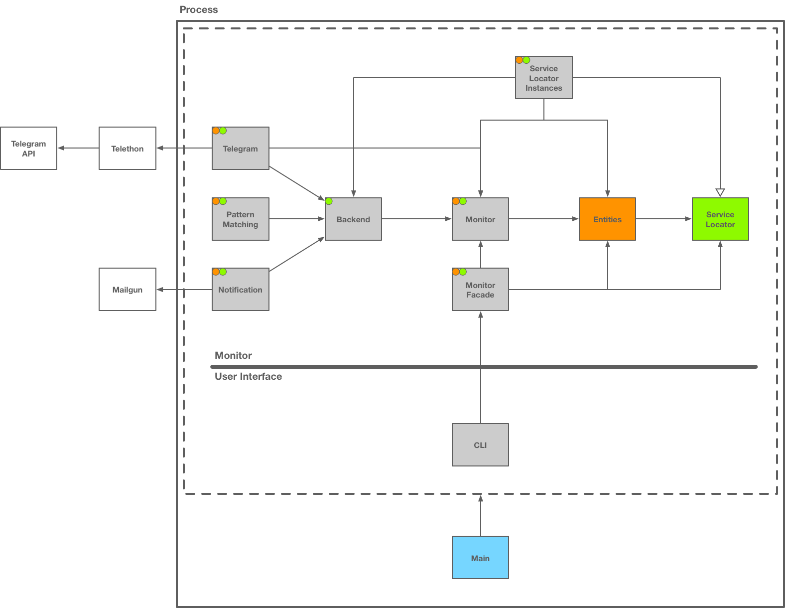

# TG-Monitor CLI Application

**Version: 0.0.4**

TG-Monitor application with CLI user interface.

## Notes

- The CLI runs in the same process as the monitor, thus, quitting the CLI terminates the monitor.
- Logged-in Telegram session is saved persistently in `/var/tmp/tg-monitor/telethon` on local machine. A logged-in session is reused across runs of the application, so there is no need to log in at each run.

## Component Architecture

## Distribution

- [main-0.0.4.zip](main-0.0.4.zip): standalone executable distribution archive of the application containing all code dependencies.
    - Created with Gradle `distZip` task of the [Distribution Plugin](https://docs.gradle.org/current/userguide/distribution_plugin.html).

## Code Dependencies

See [Release Note](https://github.com/TG-Monitor/applicaton-cli/releases/tag/0.0.4)

## Platform Dependencies

- Java ≥ 8u91
- Python 3
- [Telethon 1.04](https://github.com/LonamiWebs/Telethon/releases/tag/v1.0.4)

## Docker

- [Dockerfile](Dockerfile) for creating a Docker image of the application
- [docker-run.sh](docker-run.sh): command for running the Docker image
- Image on [Docker Hub](https://hub.docker.com/r/weibeld/tg-monitor/tags/): `weibeld/tg-monitor:0.0.4-cli`

## Documentation

- Documentations about architecture and other aspects in [doc/](doc)
